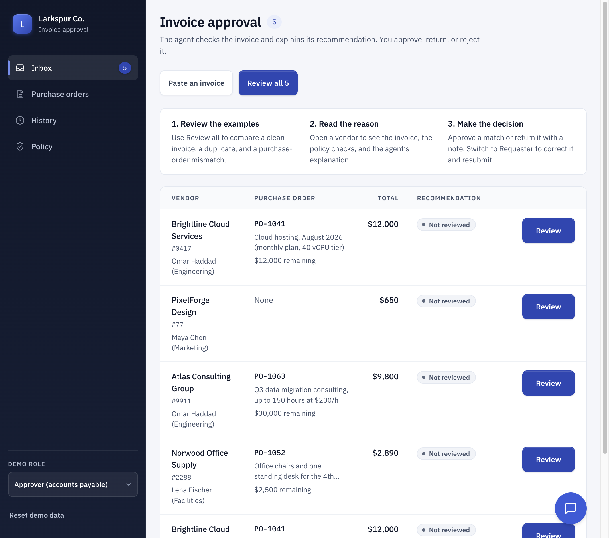

# Invoice Approval Example

An Amodal demo that reads vendor invoices, checks purchase orders and a
spend policy, and explains what needs attention. A person makes the decision.



Paste a vendor email or PDF text, or use the five examples. The demo shows
extraction, agent judgment, deterministic policy checks, saved records, and
human approval in one workflow. Vendors, people, invoices, and policy are
fictional. Approving an invoice records a decision; it does not send payment.

## Try it in three minutes

Deploy this repository to Amodal and open the app. It loads the examples
automatically. No external integration is needed.

1. Click **Review all 5**. Each invoice gets a recommendation and a short
   reason. Brightline matches its order; Atlas includes work outside its
   order; the second Brightline invoice is a duplicate.
2. Open **Atlas Consulting Group**. Compare its line items with the purchase
   order and read the review. The amounts fit, but the marketing workshop
   is outside the data-migration work that was ordered.
3. Approve the original Brightline invoice and confirm. Its purchase-order
   balance changes, and **History** records your decision.
4. Return Norwood with a note to remove the rush fee and reduce the invoice
   to the order balance. Switch **Demo role** to **Requester**, open
   **My invoices**, and edit the returned invoice. Remove the rush fee and
   reduce the goods to $2,500 or less, then resubmit. Switch back to approve
   the corrected revision.
5. Click **Paste an invoice** and choose a sample email. The extractor reads
   it, and the reviewer checks it. Ask chat “what happened to Atlas's
   invoice?” to see an answer grounded in the saved history.

**Reset demo data** restores the examples after confirmation.

| Example | What it demonstrates | Expected recommendation |
| --- | --- | --- |
| Brightline #0417 | Exact purchase-order match | Approve |
| Norwood #2288 | Amount exceeds the remaining balance and tolerance | Escalate |
| Atlas #9911 | In-scope amounts, out-of-scope work | Hold |
| PixelForge #77 | Small invoice with a named requester and no order | Approve |
| Brightline #0417 resend | Duplicate invoice | Reject |

## How it works

| Responsibility | Implementation |
| --- | --- |
| Read invoice text | `agents/invoice-extractor/` |
| Match vendor and order, detect duplicates, calculate amounts | `amodal/_lib/invoice-review.ts`, `policy.ts` |
| Interpret scope and fees against the policy | `agents/invoice-reviewer/` |
| Save submissions, reviews, decisions, and history | `amodal/tools/`, four `amodal/stores/` schemas |
| Confirm a human decision and recheck the hard rules | `amodal/tools/decide_invoice/` |
| Check approval writes against policy | `hooks/approval-guard/` |
| Present the inbox, requester form, and history | `src/` |

The reviewer recommends; the decision handler validates and records the
human action. Reviews cannot reopen approved or rejected invoices. A returned
invoice must be edited and resubmitted. If review fails after a submission
was saved, the UI keeps its record and offers a review retry through the inbox.

The role switch demonstrates two views of shared data. It is not user
authentication or per-requester access control. See [SPEC.md](SPEC.md) for
lifecycle, runtime constraints, and the guard's limits.

## Read-only API and OpenAPI discovery

The deployed app serves `/openapi.json`. It describes the runtime's existing
GET endpoints for listing invoices and purchase orders and reading one record.
Another Amodal agent can discover these operations from the document URL.

[API setup and examples](docs/api.md) covers runtime credentials, `curl`,
pagination, and the consuming agent's OpenAPI connection. The API exposes
saved demo records. It does not expose an approval operation in the contract.

## Develop and verify

```sh
npm install
npm run dev
npm test
npm run typecheck
npm run build
amodal eval
```

The Vite development server needs an Amodal runtime at
`VITE_RUNTIME_URL` (default `http://localhost:3001`). Cloud supplies a
same-origin runtime URL when building the app. Vite alone serves the UI;
it does not run the agents or stores.

`npm test` covers arithmetic, workflow transitions, hooks, UI recovery,
contrast, and the OpenAPI contract. There is no separate lint command.
The `evals/` suite checks model behavior against a runtime; local unit tests
use simulated model replies. Use an Amodal CLI compatible with the manifest.

## Adapt the template

- Change the examples in `amodal/_lib/examples.ts`.
- Change judgment rules in `amodal/knowledge/spend-policy.md` and the
  reviewer prompt. Change numeric thresholds together in that policy,
  `amodal/_lib/policy.ts`, and `hooks/approval-guard/hook.json`.
- Add fields to the store schema before changing handlers or the UI.
  Keep `public/openapi.json` aligned with exposed stores.
- Keep regression tests for hard rules and update the relevant eval
  expectations when policy changes. Editing policy prose alone does not
  change the arithmetic enforced by code.

[amodal-demo](https://github.com/amodalai/amodal-demo) introduces the platform's
building blocks one at a time. [access-request-agent](https://github.com/amodalai/access-request-agent)
uses the same review-and-decide pattern for IT access. This template omits
payment, real identity, file uploads, notifications, and production accounting
integrations.
